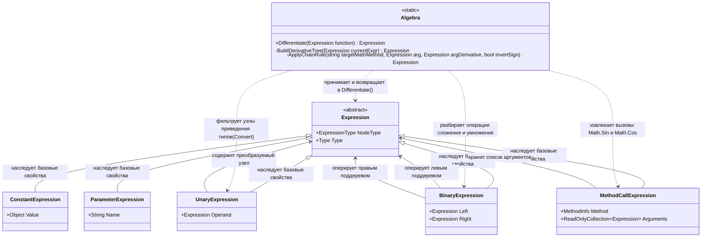

# Дифференцирование

## 1.Описание предметной области и сущностей:
Algebra: содержит реализацию правил дифференцирования, принимая исходное дерево выражений и решение о том, как именно его дифференцировать.
Expression: определяет общий контракт для всех элементов дерева.
ConstantExpression: числовое значение(константа), которое по правилам дифференцирования превращается в 0.
ParameterExpression: переменная, то бишь аргумент функции, по которому ведется дифференцирование.Преобразуентся в константу со значением 1.
BinaryExpression: составная сущность, инкапсулирует математические операции, требующие двух операндов(сложение, умножение).Содержит строгие структурные связи, ссылаясь на "левое" и "правое" подвыражения.
MethodCallExpression: составная сущность, которая представляет вызов сложных функций(таких, как Sin и Cos).Обработка этой сущности требует применения алгоритма дифференцирования для сложной функции(Chain Rule).
UnaryExpression: dспомогательная сущность.Обеспечивает целостность данных при неявном изменении типов(например, когда целое число должно восприниматься как вещественное).

## 2.Диаграмма классов:

