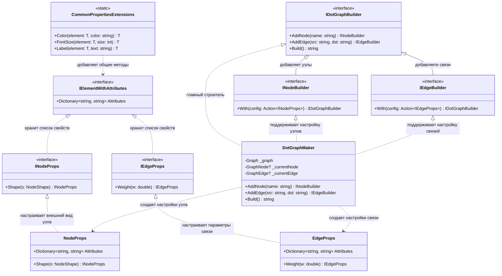

# GraphViz

## 1.Описание предметной области и сущностей:
Graph: главный контейнер, который хранит список всех узлов и связей.Он знает типа графа и умеет преобразовывать всё своё содержимое в строковый формат DOT.
GraphNode: отдельный элемент графа.Имеет уникальное имя и словарь атрибутов, в котором хранятся настройки оформления.
GraphEdge: соединительная часть двух узлов, обладает собственным словарем атрибутов для управления стилем линии и подписями.
IDotGraphBuilder: позволяет начать создание графа и добавлять в него элементы.
INodeProps, IEdgeProps: вспомогательные объекты, которые появляются при вызове метода With().Позволяют удобно задавать параметры(например, Color("blue") или Weight(2.0)), не обращаясь к словарю напрямую.
DotFormatWriter: берет структуру графа и аккуратно записывает её в нужный текстовый формат
CommonPropertiesExtensions: набор методов, которые позволяют добавлять настройки(например: цвет, размер шрифта) к любому объекту, имеющему атрибуты, без дублирования кода в каждом классе.

## 2.Диаграмма классов:

