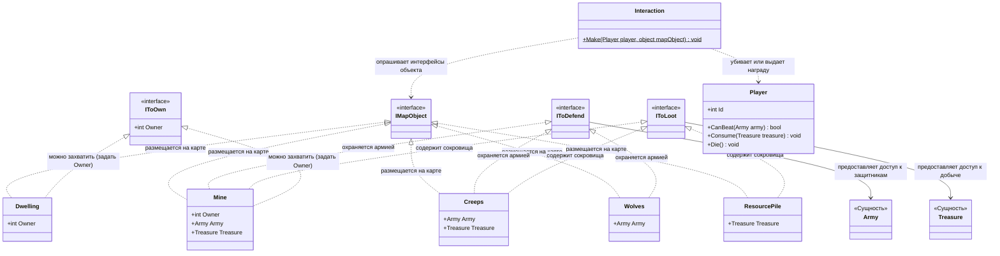

# HoMM

## 1.Описание предметной области и сущностей:
Player: может быть жив или мертв.С уникальным идентификатором Id и имеет набор методов для обработки результатов взаимодействия(CanBeat сопоставляет сиды игрока с армией, Consume усваивает полученные ресурсы, Die вызывается в случае поражения)
Dwelling(жилье): это мирный или нейтральный объект, который можно захватить с помощью IToOwn.
Mine(шахта): охраняется армией с помощью IToDefend, и также с нее можно собрать сокровища с IToLoot и захватить ее с помощью IToOWn.
Creep(лагерь с монстрами): захищает сокровища с помощью IToDefend и после победы игрок получает награду с помощью IToLoot.
Wolves(волки): имеют армию для сражения с помощью IToDefend.
ResourcePile(куча ресурсов): мирная территория, с которйой можно забрать сокровища с помощью IToLoot.
Interaction с Mаke: сначала проверяет IToDefend.Если бой выигран или его не было, то срабатывают IToLoot и IToOwn.Если проигран, то игрок умирает.
## 2.Диаграмма классов:

