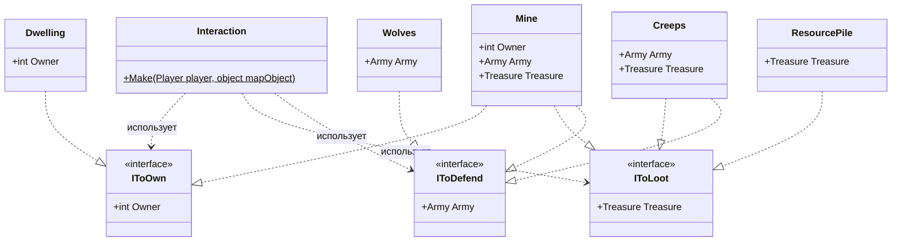

# HoMM

## 1.Описание предметной области и сущностей:

## 2.Диаграмма классов:

```mermaid

classDiagram
    class IToDefend {
        <<interface>>
        +Army Army
    }
    class IToLoot {
        <<interface>>
        +Treasure Treasure
    }
    class IToOwn {
        <<interface>>
        +int Owner
    }

    class Dwelling {
        +int Owner
    }
    class Mine {
        +int Owner
        +Army Army
        +Treasure Treasure
    }
    class Creeps {
        +Army Army
        +Treasure Treasure
    }
    class Wolves {
        +Army Army
    }
    class ResourcePile {
        +Treasure Treasure
    }

    class Interaction {
        +Make(Player player, object mapObject)$
    }

    Dwelling ..|> IToOwn
    Mine ..|> IToDefend
    Mine ..|> IToLoot
    Mine ..|> IToOwn
    Creeps ..|> IToDefend
    Creeps ..|> IToLoot
    Wolves ..|> IToDefend
    ResourcePile ..|> IToLoot
    
    Interaction ..> IToDefend : использует
    Interaction ..> IToLoot : использует
    Interaction ..> IToOwn : использует
```