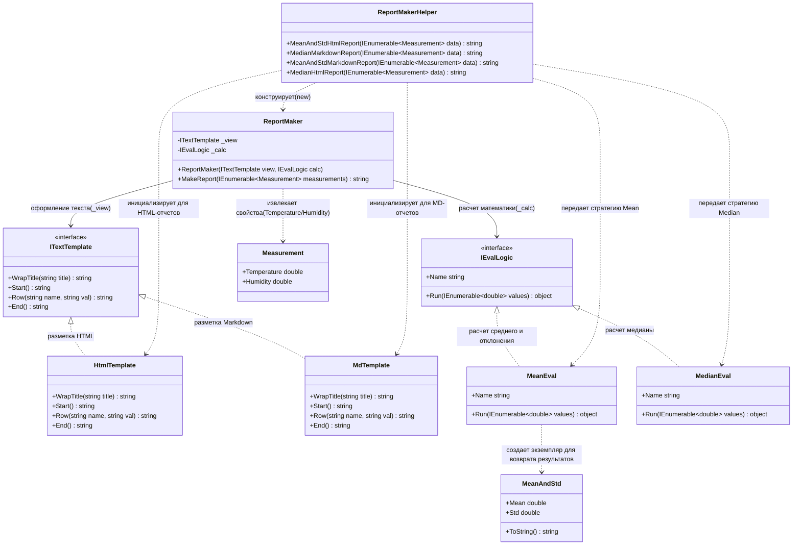

# Генератор отчетов

## 1.Описание предметной области и сущностей:
Measurement: хранит запись о метеорологическом замере: температуру Temperature и влажность Humidity.
MeanAndStd: инкапсулирует вычисленное среднее значение Mean и стандартное отклонение Std, а также переопределяет метод ToString() для их корректного строкового представления.
ITextTemplate: содержит логику оформления отчетов, оперируя только строковым типом данных.Описывает контракт из четырех методов: создание заголовка, открытие списка, формирование строки данных, закрытие списка.
IEvalLogic: содержит алгоритмы статистической обработки.Принимает на вход набор чисел IEnumerable и возвращает результат object.
HtmlTemplate: реализует ITextTemplate, превращая данные в HTML-теги.
MdTemplate: реализует ITextTemplate, формируя отчет по правилам разметки Markdown.
MeanEval: реализует IEvalLogic.Обрабатывает массив чисел, вычисляя математическое ожидание и среднеквадратическое отклонение, возвращая объект MeanAndStd.
MedianEval: также реализует IEvalLogic.Сортирует массив чисел и находит медиану, возвращая число.
ReportMaker: координатор, хранито ссылки на интерфейсы ITextTemplate и IEvalLogic.Получает на вход коллекцию измерений Measurement и, извлекая конкретные показатели, передает их в вычислительную логику.
ReportMakerHelper: предоставляет настроенные сборки ReportMaker.

## 2.Диаграмма классов:

