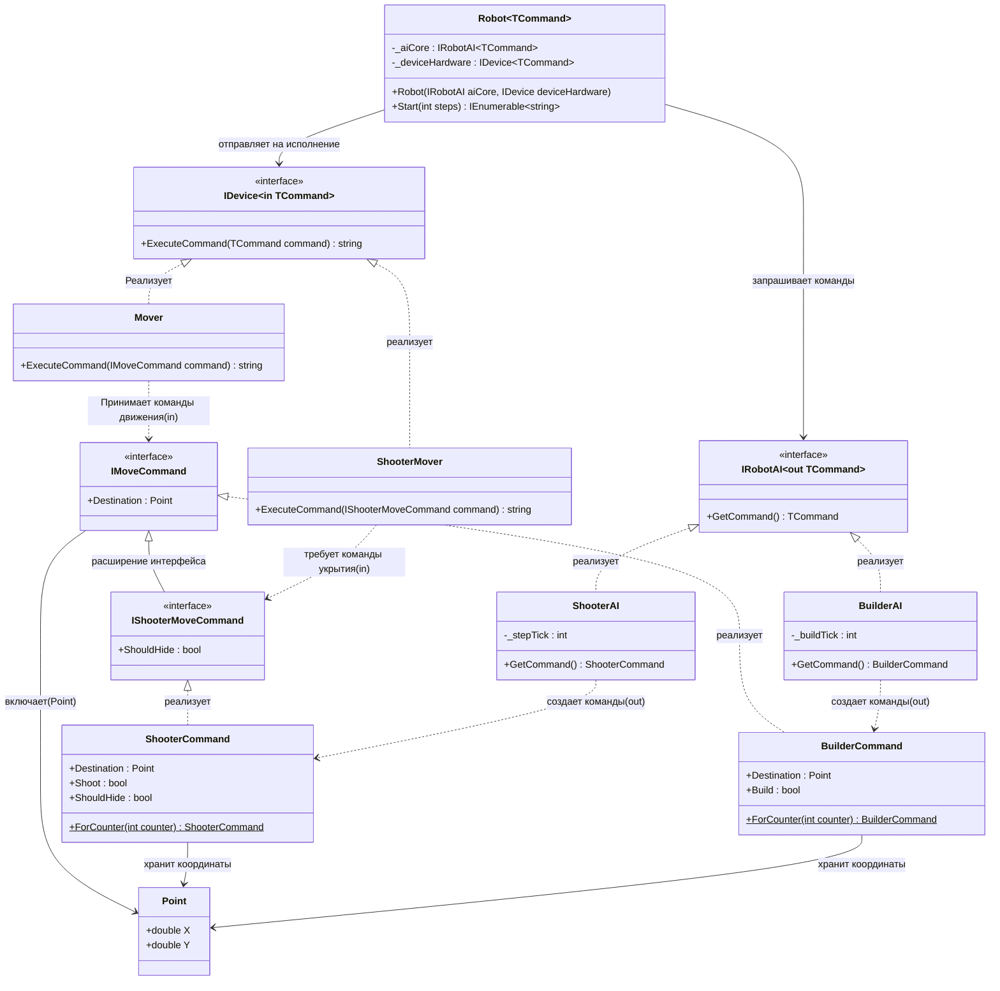

# Геометрия-2

## 1.Описание предметной области и сущностей:
Point: сущность для указания цели, представляющая координаты Х и У.
IMoveCommand: интерфейс для любой команды перемещения.Гарантирнует наличие точки назначения с помощью Destination.
IShooterMoveCommand: используется для роботов-бойцов и добавляет требование знать, нужно ли использовать укрытие с помощью ShouldHide.
BuilderCommand: реализация команды для робота-строителя, содержит координаты и флаг необходимости постройки с помощью Build.
ShooterCommand: реализация команды для робота-бойца.Содержит координаты, флаги стрельбы с помощью Shoot, а также информацию о том, необходимо ли укрытие(ShouldHide).
IRobotAI: производит команды.
BuilderAI: производит команды для роботов-строителей с помощью BuilderCommand.
ShooterAI: производит команды для роботов-бойцов с помощью ShooterCommand.
IDevice: исполнительный механизм, потребляет команды.
Mover: обрабатывает команды IMoveCommand и выдает инструкцию для движения.
ShooterMover: требует команд типа IShooterMoveCommand для того,чтобы понять, когда использовать укрытие.
Robot: инкапсулирует внутри себя IRobotAI и исполнителя IDevice, управялет роботом с помощью Start, запрашивая команды у ИИ и передавая их на исполнение.

## 2.Диаграмма классов:

