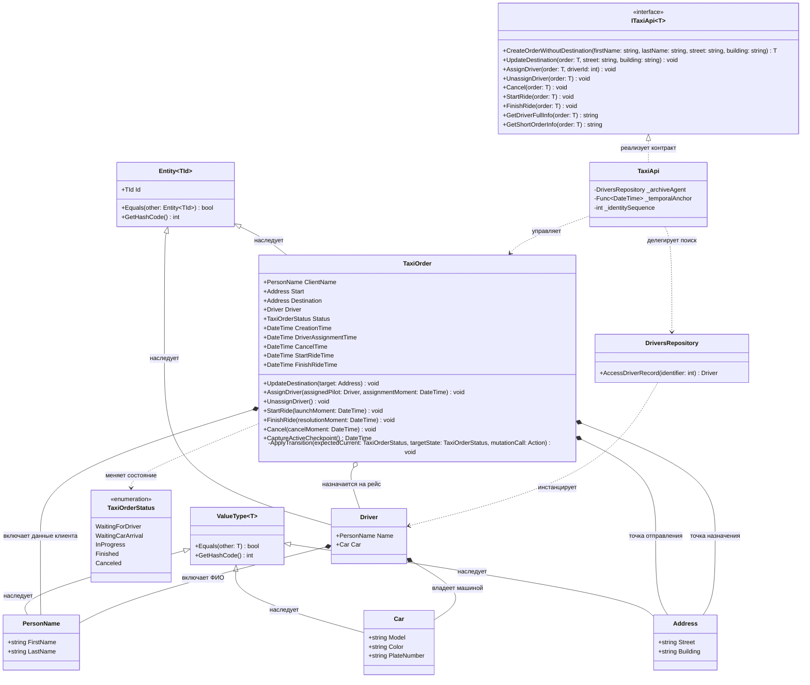

# TaxiOrder

## 1.Описание предметной области и сущностей:
TaxiOrder: центральный узел, управляющий всеми вложенными объектами.Любые изменения происходят только через публичные контракты-методы(AssignDriver, StartRide, Cancel).
Driver: сотрудник-водитель.Идентифицируется уникальным номером, тк некоторые его данные(например, фамилия или машина) могут со временем измениться.При правке таких данных фактически сотрудник останется тем-же самым.
PersonName: хранит имя и фамилию.Используется, как для клиента такси, так и для водителя.
Address: географическая точка, состоящая из улицы и номера здания.Используется для формирования маршрута: точки отправления Start и назначения Destination.
Car: автомобиль.Имеет технические характеристики назначенного транспорта(модель, цвет, гос. номер).Привязан к водителю.
TaxiApi: выполняет роль интерфейса между внешним миром и доменной моделью.Его задача - это принять команду, запросить нужные данные из базы.
DriversRepository: ищет и собирает сущность Driver по идентификатору.Полностью отвязан от контекста заказов и ничего не знает про поездки.
TaxiOrderStatus: матрица конченых состояний заказа(WaitingForDriver, WaitingCarArrival, InProgress, Finished, Canceled).

## 2.Диаграмма классов:

